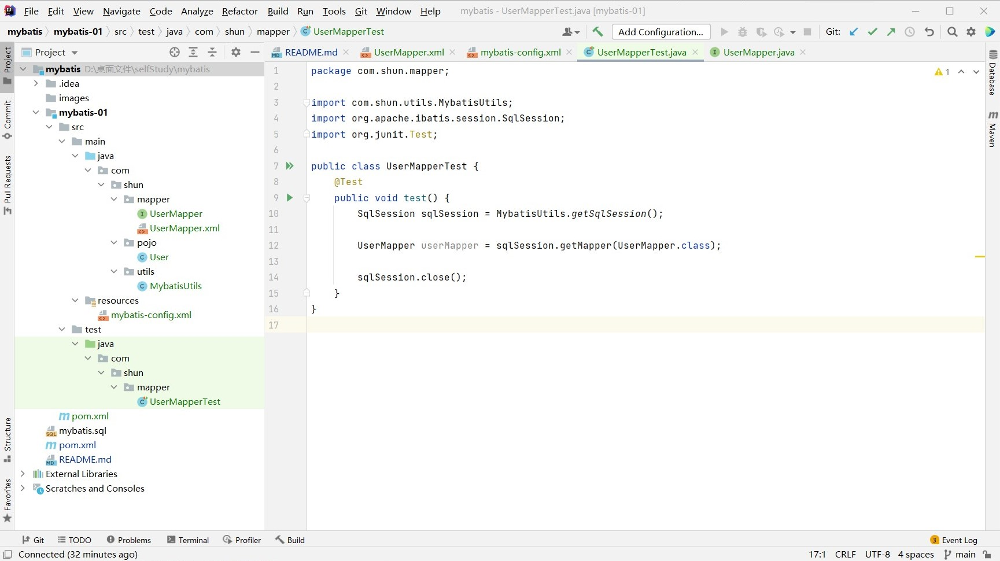

# Mybatis
Official website: https://mybatis.org/mybatis-3/zh/index.html
# Project structure and configuration
1. Create maven
2. Delete src folder
3. Maven dependencies and another module
4. resources --> Mybatis-config.xml
5. utils --> MybatisUtils.class
6. pojo --> .class
7. mapper --> PojoMapper.interface and PojoMapper.xml
8. junit test
9. resources --> Mybatis-config.xml register mapper --> PojoMapper.xml
10. pom build export config
structure
   


### 3. Maven dependencies
``` xml
    <dependencies>
        <dependency>
            <groupId>mysql</groupId>
            <artifactId>mysql-connector-java</artifactId>
            <version>5.1.47</version>
        </dependency>

        <dependency>
            <groupId>org.mybatis</groupId>
            <artifactId>mybatis</artifactId>
            <version>3.5.2</version>
        </dependency>

        <dependency>
            <groupId>junit</groupId>
            <artifactId>junit</artifactId>
            <version>4.12</version>
        </dependency>
    </dependencies>
```

### 4. resources --> Mybatis-config.xml
``` xml
   <?xml version="1.0" encoding="UTF-8" ?>
   <!DOCTYPE configuration
           PUBLIC "-//mybatis.org//DTD Config 3.0//EN"
           "http://mybatis.org/dtd/mybatis-3-config.dtd">
   <configuration>
       <environments default="development">
           <environment id="development">
               <transactionManager type="JDBC"/>
               <dataSource type="POOLED">
                   <property name="driver" value="com.mysql.jdbc.Driver"/>
                   <property name="url" value="jdbc:mysql://localhost:3306/mybatis?useSSL=false&amp;useUnicode=true&amp;characterEncoding=UTF-8"/>
                   <property name="username" value="root"/>
                   <property name="password" value="qpuur990415"/>
               </dataSource>
           </environment>
       </environments>
   </configuration>
```

### 5. utils --> MybatisUtils.class
``` java
   package com.shun.utils;
   
   import org.apache.ibatis.io.Resources;
   import org.apache.ibatis.session.SqlSession;
   import org.apache.ibatis.session.SqlSessionFactory;
   import org.apache.ibatis.session.SqlSessionFactoryBuilder;
   
   import java.io.IOException;
   import java.io.InputStream;
   
   //sqlSessionFactory --> sqlSession
   public class MybatisUtils {
       private static SqlSessionFactory sqlSessionFactory;
   
       static {
           try {
               String resource = "mybatis-config.xml";
               InputStream inputStream = Resources.getResourceAsStream(resource);
               sqlSessionFactory = new SqlSessionFactoryBuilder().build(inputStream);
           } catch (IOException e) {
               e.printStackTrace();
           }
       }
   
           public static SqlSession getSqlSession() {
               return sqlSessionFactory.openSession();
           }
   }
```

### 8. junit test template
``` java
    package com.shun.mapper;
    
    import com.shun.utils.MybatisUtils;
    import org.apache.ibatis.session.SqlSession;
    import org.junit.Test;
    
    public class UserMapperTest {
        @Test
        public void test() {
            SqlSession sqlSession = MybatisUtils.getSqlSession();
    
            UserMapper userMapper = sqlSession.getMapper(UserMapper.class);
    
            sqlSession.close();
        }
    }
```


### 9. resources --> Mybatis-config.xml register mapper --> PojoMapper.xml
``` xml
    <mappers>
        <mapper resource="com/shun/mapper/UserMapper.xml"/>
    </mappers>
```


## 10. pom build export config
``` xml
   <build>
      <resources>
         <resource>
             <directory>src/main/resources</directory>
             <includes>
                 <include>**/*.properties</include>
                 <include>**/*.xml</include>
             </includes>
             <filtering>true</filtering>
         </resource>
         <resource>
             <directory>src/main/java</directory>
             <includes>
                 <include>**/*.properties</include>
                 <include>**/*.xml</include>
             </includes>
             <filtering>true</filtering>
         </resource>
      </resources>
   </build>
```


|situation|syntax|
|-----------|-----------|
|Before| href="${pageContext.request.contextPath}/css/style.css"|
|After|href="${pageContext.request.contextPath}/css/style.css?1"|
